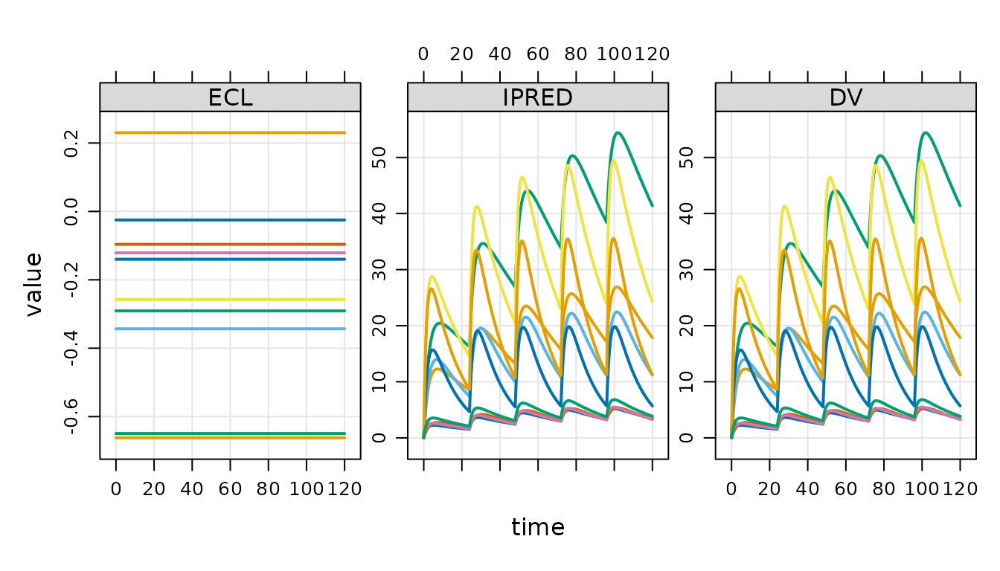

# Get Started

``` r

library(mrgsim.ds)
library(dplyr)
```

## Load the model

Load a model using
[`mread_ds()`](https://kylebaron.github.io/mrgsim.ds/reference/mread_ds.md)
or other friends.

``` r

mod <- mread_ds("popex-2.mod", outvars = "IPRED, DV, ECL")
```

This model is almost identical to the same model loaded with
[`mread()`](https://mrgsolve.org/docs/reference/mread.html); there is
just some extra information included in the model object to make sure it
works well with the `mrgsim.ds` approach.

Other functions you can use to load a model include

- [`mcode_ds()`](https://kylebaron.github.io/mrgsim.ds/reference/mread_ds.md)
- [`modlib_ds()`](https://kylebaron.github.io/mrgsim.ds/reference/mread_ds.md)
- [`house_ds()`](https://kylebaron.github.io/mrgsim.ds/reference/mread_ds.md)
- [`mread_cache_ds()`](https://kylebaron.github.io/mrgsim.ds/reference/mread_ds.md)

These all mimic the corresponding functions in mrgsolve.

## Simulate

To simulate, call
[`mrgsim_ds()`](https://kylebaron.github.io/mrgsim.ds/reference/mrgsim_ds.md);
any arguments get passed to
[`mrgsim()`](https://mrgsolve.org/docs/reference/mrgsim.html).

``` r

data <- evd_expand(amt = c(100, 300, 700), ii = 24, addl = 4, ID = 1:10)

data <- mutate(data, dose = AMT)

set.seed(98)
out <- mrgsim_ds(mod, data = data, end = 5*24, recover = "dose")
```

The output behaves very similarly to regular
[`mrgsim()`](https://mrgsolve.org/docs/reference/mrgsim.html) output.

``` r

out
```

    ## Model: popex-2_mod
    ## Dim  : 7,260 x 6
    ## Files: 1 [140.2 Kb]
    ## Owner: yes (gc)
    ##     ID TIME        ECL     IPRED        DV dose
    ## 1:   1  0.0 -0.1397334 0.0000000 0.0000000  100
    ## 2:   1  0.0 -0.1397334 0.0000000 0.0000000  100
    ## 3:   1  0.5 -0.1397334 0.7493918 0.7493918  100
    ## 4:   1  1.0 -0.1397334 1.2650920 1.2650920  100
    ## 5:   1  1.5 -0.1397334 1.6175329 1.6175329  100
    ## 6:   1  2.0 -0.1397334 1.8559447 1.8559447  100
    ## 7:   1  2.5 -0.1397334 2.0147377 2.0147377  100
    ## 8:   1  3.0 -0.1397334 2.1179631 2.1179631  100

``` r

head(out)
```

    ## # A tibble: 6 × 6
    ##      ID  TIME    ECL IPRED    DV  dose
    ##   <dbl> <dbl>  <dbl> <dbl> <dbl> <dbl>
    ## 1     1   0   -0.140 0     0       100
    ## 2     1   0   -0.140 0     0       100
    ## 3     1   0.5 -0.140 0.749 0.749   100
    ## 4     1   1   -0.140 1.27  1.27    100
    ## 5     1   1.5 -0.140 1.62  1.62    100
    ## 6     1   2   -0.140 1.86  1.86    100

``` r

tail(out)
```

    ## # A tibble: 6 × 6
    ##      ID  TIME      ECL IPRED    DV  dose
    ##   <dbl> <dbl>    <dbl> <dbl> <dbl> <dbl>
    ## 1    30  118. -0.00385  19.4  19.4   700
    ## 2    30  118  -0.00385  19.0  19.0   700
    ## 3    30  118. -0.00385  18.5  18.5   700
    ## 4    30  119  -0.00385  18.1  18.1   700
    ## 5    30  120. -0.00385  17.7  17.7   700
    ## 6    30  120  -0.00385  17.2  17.2   700

``` r

dim(out)
```

    ## [1] 7260    6

``` r

names(out)
```

    ## [1] "ID"    "TIME"  "ECL"   "IPRED" "DV"    "dose"

``` r

plot(out, nid = 10)
```



`out` owns the file that contains the simulated data.

``` r

ownership()
```

    ## > Objects: 1 | Files: 1 | Size: 140.2 Kb

``` r

check_ownership(out)
```

    ## [1] TRUE

This object is an environment and therefore is modified by reference. If
you want to make a copy of this object, use
[`copy_ds()`](https://kylebaron.github.io/mrgsim.ds/reference/copy_ds.md).

``` r

out2 <- copy_ds(out, own = TRUE)
```

You can specify which object will own the files on copy.

## Summarizing outputs with arrow

mrgsim.ds provides access points to dplyr / arrow data wrangling
pipelines.

``` r

out %>% 
  filter(TIME == 5*24) %>% 
  select(TIME, dose, IPRED) %>% 
  group_by(dose) %>% 
  summarise( 
    Min = min(IPRED), 
    Mean = mean(IPRED), 
    Max = max(IPRED), 
    .groups = "drop"
  ) %>% collect()
```

    ## # A tibble: 3 × 4
    ##    dose   Min  Mean   Max
    ##   <dbl> <dbl> <dbl> <dbl>
    ## 1   100  2.02  3.39  4.97
    ## 2   300  5.70 10.6  17.9 
    ## 3   700  7.29 18.6  41.4

Note that we must call
[`collect()`](https://dplyr.tidyverse.org/reference/compute.html) or
[`as_tibble()`](https://tibble.tidyverse.org/reference/as_tibble.html)
here in order to realize the summarized results.

See the Arrow documentation for more details on these Arrow pipelines.
For now, note that if you want exact quantile summaries (including
median), you have to convert to a duckdb object. This is cheap and easy
to do with the
[`as_duckdb_ds()`](https://kylebaron.github.io/mrgsim.ds/reference/as_duckdb_ds.md)
function.

``` r

out %>% 
  as_duckdb_ds() %>% 
  filter(TIME == 5*24) %>% 
  select(TIME, dose, IPRED) %>% 
  group_by(dose) %>% 
  summarise( 
    P5 = quantile(IPRED, 0.05, na.rm = TRUE), 
    Mean = mean(IPRED), 
    Median = median(IPRED),
    P95 = quantile(IPRED, 0.95, na.rm = TRUE), 
    .groups = "drop"
  ) %>% collect()
```

    ## Warning: Missing values are always removed in SQL aggregation functions.
    ## Use `na.rm = TRUE` to silence this warning
    ## This warning is displayed once every 8 hours.

    ## # A tibble: 3 × 5
    ##    dose    P5  Mean Median   P95
    ##   <dbl> <dbl> <dbl>  <dbl> <dbl>
    ## 1   100  2.03  3.39   3.42  4.97
    ## 2   700  7.93 18.6   16.8  35.8 
    ## 3   300  6.74 10.6   10.3  15.5

If you only want to get your simulated data as an R data frame, simply
coerce to `tibble`.

``` r

as_tibble(out)
```

    ## # A tibble: 7,260 × 6
    ##       ID  TIME    ECL IPRED    DV  dose
    ##    <dbl> <dbl>  <dbl> <dbl> <dbl> <dbl>
    ##  1     1   0   -0.140 0     0       100
    ##  2     1   0   -0.140 0     0       100
    ##  3     1   0.5 -0.140 0.749 0.749   100
    ##  4     1   1   -0.140 1.27  1.27    100
    ##  5     1   1.5 -0.140 1.62  1.62    100
    ##  6     1   2   -0.140 1.86  1.86    100
    ##  7     1   2.5 -0.140 2.01  2.01    100
    ##  8     1   3   -0.140 2.12  2.12    100
    ##  9     1   3.5 -0.140 2.18  2.18    100
    ## 10     1   4   -0.140 2.22  2.22    100
    ## # ℹ 7,250 more rows

If you want the arrow data set object:

``` r

as_arrow_ds(out)
```

    ## FileSystemDataset with 1 Parquet file
    ## 6 columns
    ## ID: double
    ## TIME: double
    ## ECL: double
    ## IPRED: double
    ## DV: double
    ## dose: double
    ## 
    ## See $metadata for additional Schema metadata

If you want an arrow table object:

``` r

arrow::as_arrow_table(out)
```

    ## Table
    ## 7260 rows x 6 columns
    ## $ID <double>
    ## $TIME <double>
    ## $ECL <double>
    ## $IPRED <double>
    ## $DV <double>
    ## $dose <double>
    ## 
    ## See $metadata for additional Schema metadata

## Working with lists of objects

mrgsim.ds provides utilities for working with lists of output objects
that are typically realized when simulating replicates in parallel.

Here are 10 simulation replicates.

``` r

out <- lapply(1:10, \(x) mrgsim_ds(mod, data)) 
```

Because we used [`lapply()`](https://rdrr.io/r/base/lapply.html), the
result is a list of simulation output objects

``` r

class(out)
```

    ## [1] "list"

We’d like to work with these simulations as a single object. To do that,
use
[`reduce_ds()`](https://kylebaron.github.io/mrgsim.ds/reference/reduce_ds.md)

``` r

out <- reduce_ds(out)
```

This leaves the backing files where they are, but creates a single
object that now holds a single pointer to all 10 files.

## Working with simulation files

In the last simulation, we created a list of output objects and then
reduced that list to a single object with the outputs held in 10 parquet
files. You can see these files when they are in
[`tempdir()`](https://rdrr.io/r/base/tempfile.html).

``` r

list_temp()
```

    ## 10 files [2.9 Mb]
    ## - mrgsims-ds-1c6a24ea8c92.parquet
    ## - mrgsims-ds-1c6a30b06d2c.parquet
    ##    ...
    ## - mrgsims-ds-1c6a756d9c1c.parquet
    ## - mrgsims-ds-1c6a87afc99.parquet

Or get a list of the files as an R character vector:

``` r

files_ds(out)
```

    ##  [1] "/tmp/Rtmp9uNpgi/mrgsims-ds-1c6a24ea8c92.parquet"
    ##  [2] "/tmp/Rtmp9uNpgi/mrgsims-ds-1c6a30b06d2c.parquet"
    ##  [3] "/tmp/Rtmp9uNpgi/mrgsims-ds-1c6a756d9c1c.parquet"
    ##  [4] "/tmp/Rtmp9uNpgi/mrgsims-ds-1c6a87afc99.parquet" 
    ##  [5] "/tmp/Rtmp9uNpgi/mrgsims-ds-1c6a3d9be597.parquet"
    ##  [6] "/tmp/Rtmp9uNpgi/mrgsims-ds-1c6a6ada17be.parquet"
    ##  [7] "/tmp/Rtmp9uNpgi/mrgsims-ds-1c6a5bfb3332.parquet"
    ##  [8] "/tmp/Rtmp9uNpgi/mrgsims-ds-1c6a52f041c8.parquet"
    ##  [9] "/tmp/Rtmp9uNpgi/mrgsims-ds-1c6a7313e01e.parquet"
    ## [10] "/tmp/Rtmp9uNpgi/mrgsims-ds-1c6a6d8d3f3b.parquet"

To save outputs to a persistent location, use
[`save_ds()`](https://kylebaron.github.io/mrgsim.ds/reference/save_ds.md).

``` r

save_ds(out, file = file.path(save_dir, "sims.rds"))
```

This creates an `.rds` file holding the (very lightweight) simulation
output object *and* it relocates all the backing files to `save_dir`.

To read the simulations back into R:

``` r

bah <- read_ds(file.path(save_dir, "sims.rds"))

bah
```

    ## Model: popex-2_mod
    ## Dim  : 144.6K x 5
    ## Files: 10 [2.9 Mb]
    ## Owner: yes (no gc)
    ##     ID TIME        ECL    IPRED       DV
    ## 1:   1  0.0 -0.0317765 0.000000 0.000000
    ## 2:   1  0.0 -0.0317765 0.000000 0.000000
    ## 3:   1  0.5 -0.0317765 1.851493 1.851493
    ## 4:   1  1.0 -0.0317765 2.833834 2.833834
    ## 5:   1  1.5 -0.0317765 3.338411 3.338411
    ## 6:   1  2.0 -0.0317765 3.580684 3.580684
    ## 7:   1  2.5 -0.0317765 3.679257 3.679257
    ## 8:   1  3.0 -0.0317765 3.699414 3.699414

An alternative is to rename and move.

``` r

rename_ds(bah, "regimen-1")
move_ds(bah, save_dir)
```

    ## ℹ 10 files are now located in /tmp/Rtmp9uNpgi; gc is off.

If you want all the simulated data output in a single parquet file that
you name and locate.

``` r

write_parquet_ds(x = bah, sink = "new/path/file.parquet")
```

## Garbage collection

    ## Discarding 10 files.

When a new simulation output object is created, that object owns the
files and, by default, the files will be deleted as soon as the object
goes out of scope. The files are deleted when the R garbage collector is
called.

``` r

out <- mrgsim_ds(mod, data)

out
```

    ## Model: popex-2_mod
    ## Dim  : 14,460 x 5
    ## Files: 1 [295 Kb]
    ## Owner: yes (gc)
    ##     ID TIME        ECL    IPRED       DV
    ## 1:   1  0.0 -0.3538907 0.000000 0.000000
    ## 2:   1  0.0 -0.3538907 0.000000 0.000000
    ## 3:   1  0.5 -0.3538907 1.456466 1.456466
    ## 4:   1  1.0 -0.3538907 2.388291 2.388291
    ## 5:   1  1.5 -0.3538907 2.977009 2.977009
    ## 6:   1  2.0 -0.3538907 3.341447 3.341447
    ## 7:   1  2.5 -0.3538907 3.559382 3.559382
    ## 8:   1  3.0 -0.3538907 3.681724 3.681724

You can see that `out` owns the files and they are marked for garbage
collection when appropriate.

``` r

output_files <- files_ds(out)

file.exists(output_files)
```

    ## [1] TRUE

Let’s blow away `out` and check the files.

``` r

rm(out)

gc()
```

    ##           used  (Mb) gc trigger (Mb) max used  (Mb)
    ## Ncells 2025431 108.2    4024015  215  4024015 215.0
    ## Vcells 3761309  28.7    8388608   64  6396854  48.9

``` r

file.exists(output_files)
```

    ## [1] FALSE

You can ask mrgsim.ds to notify you when the file gc is called. We won’t
see the message output in this vignette, but you can confirm it in your
R session.

``` r

out <- mrgsim_ds(mod, data)

out <- gc_ds(out, notify = TRUE)

rm(out)

gc()
```

    ##           used  (Mb) gc trigger (Mb) max used  (Mb)
    ## Ncells 2024824 108.2    4024015  215  4024015 215.0
    ## Vcells 3755284  28.7    8388608   64  6396854  48.9

``` r
[mrgsim.ds] cleaning up 1 file(s) ...
```

You can prevent the file gc from removing the files.

``` r

out <- mrgsim_ds(mod, data)

out <- gc_ds(out, value = FALSE)

out
```

    ## Model: popex-2_mod
    ## Dim  : 14,460 x 5
    ## Files: 1 [295 Kb]
    ## Owner: yes (no gc)
    ##     ID TIME        ECL    IPRED       DV
    ## 1:   1  0.0 -0.2222274 0.000000 0.000000
    ## 2:   1  0.0 -0.2222274 0.000000 0.000000
    ## 3:   1  0.5 -0.2222274 1.212429 1.212429
    ## 4:   1  1.0 -0.2222274 2.084579 2.084579
    ## 5:   1  1.5 -0.2222274 2.706065 2.706065
    ## 6:   1  2.0 -0.2222274 3.143001 3.143001
    ## 7:   1  2.5 -0.2222274 3.444165 3.444165
    ## 8:   1  3.0 -0.2222274 3.645541 3.645541

Now, your files will remain after the object goes out of scope. But
remember that, in this example, the files are still in
[`tempdir()`](https://rdrr.io/r/base/tempfile.html) and they will be
blown away when R restarts. So if you really want to keep the output
files safe, it’s best to use
[`save_ds()`](https://kylebaron.github.io/mrgsim.ds/reference/save_ds.md),
[`move_ds()`](https://kylebaron.github.io/mrgsim.ds/reference/move_ds.md),
or
[`write_parquet_ds()`](https://kylebaron.github.io/mrgsim.ds/reference/write_parquet_ds.md)
to relocate files out of
[`tempdir()`](https://rdrr.io/r/base/tempfile.html), while also
disabling file garbage collection.
