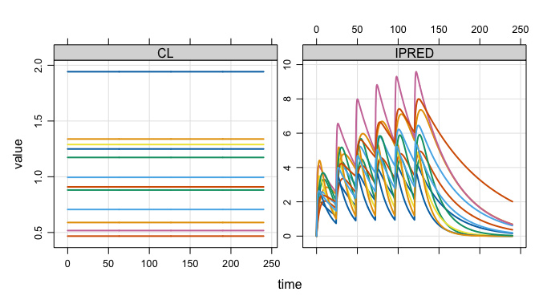
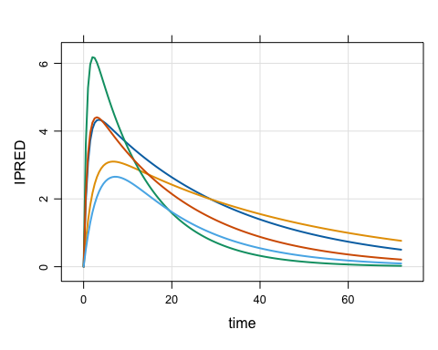

# mrgsim.ds

`mrgsim.ds` provides an [Apache
Arrow](https://arrow.apache.org/docs/r/)-backed simulation output object
for [mrgsolve](https://mrgsolve.org), greatly reducing the memory
footprint of large simulations and providing a high-performance pipeline
for summarizing huge simulation outputs. The arrow-based simulation
output objects in R claim ownership of their files on disk. Those files
are automatically removed when the owning object goes out of scope and
becomes subject to the R garbage collector. While “anonymous”,
parquet-formatted files hold the data in
[`tempdir()`](https://rdrr.io/r/base/tempfile.html) as you are working
in R, functions are provided to move this data to more permanent
locations for later use.

## Installation

You can install the development version of `mrgsim.ds` from
[r-universe](https://p-emex.r-universe.dev/mrgsim.ds) with:

``` r

# Install 'mrgsim.ds' in R:
install.packages('mrgsim.ds', repos = c('https://p-emex.r-universe.dev', 'https://cloud.r-project.org'))
```

## Example

We will illustrate `mrgsim.ds` by doing a simulation.

``` r

library(mrgsim.ds)
library(dplyr)

mod <- modlib_ds("popex", end = 240, outvars = "IPRED,CL")

data <- expand.ev(amt = 100, ii = 24, total = 6, ID = 1:3000)
```

`mrgsim.ds` provides a new
[`mrgsim()`](https://mrgsolve.org/docs/reference/mrgsim.html) variant -
[`mrgsim_ds()`](https://kylebaron.github.io/mrgsim.ds/reference/mrgsim_ds.md).
The name implies we are tapping into Apache Arrow
[Dataset](https://arrow.apache.org/docs/r/reference/Dataset.html)
functionality. The simulation below carries `1,446,000` rows.

``` r
out <- mrgsim_ds(mod, data)

out
. Model: popex
. Dim  : 1.4M x 4
. Files: 1 [13.2 Mb]
. Owner: yes (gc)
.     ID time       CL     IPRED
. 1:   1  0.0 1.249224 0.0000000
. 2:   1  0.0 1.249224 0.0000000
. 3:   1  0.5 1.249224 0.8828213
. 4:   1  1.0 1.249224 1.4027791
. 5:   1  1.5 1.249224 1.7041492
. 6:   1  2.0 1.249224 1.8739082
. 7:   1  2.5 1.249224 1.9644891
. 8:   1  3.0 1.249224 2.0074996
```

## Very lightweight simulation output object

The output object doesn’t actually carry these 1.4M rows of simulated
data. Rather it stores a pointer to the data in parquet files on your
disk.

``` r
basename(out$files)
. [1] "mrgsims-ds-141627dfeed38.parquet"
```

This means there is almost nothing inside the object itself

``` r
lobstr:::obj_size(out)
. 293.65 kB

dim(out)
. [1] 1446000       4
```

What if we did the same simulation with regular
[`mrgsim()`](https://mrgsolve.org/docs/reference/mrgsim.html)?

``` r
x <- mrgsim(mod, data)

lobstr::obj_size(x)
. 46.30 MB

dim(x)
. [1] 1446000       4

rm(x)
```

The `mrgsim.ds` object is very light weight despite tracking the same
data.

## Handles like regular mrgsim output

But, we can do a lot of the typical things we would with any
[`mrgsim()`](https://mrgsolve.org/docs/reference/mrgsim.html) output
object.

``` r

plot(out, nid = 12)
```



``` r

head(out)
. # A tibble: 6 × 4
.      ID  time    CL IPRED
.   <dbl> <dbl> <dbl> <dbl>
. 1     1   0    1.25 0    
. 2     1   0    1.25 0    
. 3     1   0.5  1.25 0.883
. 4     1   1    1.25 1.40 
. 5     1   1.5  1.25 1.70 
. 6     1   2    1.25 1.87

tail(out)
. # A tibble: 6 × 4
.      ID  time    CL IPRED
.   <dbl> <dbl> <dbl> <dbl>
. 1  3000  238. 0.620 0.222
. 2  3000  238  0.620 0.219
. 3  3000  238. 0.620 0.215
. 4  3000  239  0.620 0.212
. 5  3000  240. 0.620 0.208
. 6  3000  240  0.620 0.205

dim(out)
. [1] 1446000       4
```

This includes coercing to different types of objects. We can get the
usual R data frames

``` r
as_tibble(out)
. # A tibble: 1,446,000 × 4
.       ID  time    CL IPRED
.    <dbl> <dbl> <dbl> <dbl>
.  1     1   0    1.25 0    
.  2     1   0    1.25 0    
.  3     1   0.5  1.25 0.883
.  4     1   1    1.25 1.40 
.  5     1   1.5  1.25 1.70 
.  6     1   2    1.25 1.87 
.  7     1   2.5  1.25 1.96 
.  8     1   3    1.25 2.01 
.  9     1   3.5  1.25 2.02 
. 10     1   4    1.25 2.02 
. # ℹ 1,445,990 more rows
```

Or stay in the arrow ecosystem

``` r
as_arrow_ds(out)
. FileSystemDataset with 1 Parquet file
. 4 columns
. ID: double
. time: double
. CL: double
. IPRED: double
. 
. See $metadata for additional Schema metadata
```

Or try your hand at duckdb

``` r
as_duckdb_ds(out)
. # Source:   table<arrow_001> [?? x 4]
. # Database: DuckDB 1.5.1 [root@Darwin 25.5.0:R 4.5.3/:memory:]
.       ID  time    CL IPRED
.    <dbl> <dbl> <dbl> <dbl>
.  1     1   0    1.25 0    
.  2     1   0    1.25 0    
.  3     1   0.5  1.25 0.883
.  4     1   1    1.25 1.40 
.  5     1   1.5  1.25 1.70 
.  6     1   2    1.25 1.87 
.  7     1   2.5  1.25 1.96 
.  8     1   3    1.25 2.01 
.  9     1   3.5  1.25 2.02 
. 10     1   4    1.25 2.02 
. # ℹ more rows
```

## Tidyverse-friendly

We’ve integrated into the `dplyr` ecosystem as well, allowing you to
[`filter()`](https://dplyr.tidyverse.org/reference/filter.html),
[`group_by()`](https://dplyr.tidyverse.org/reference/group_by.html),
[`mutate()`](https://dplyr.tidyverse.org/reference/mutate.html),
[`select()`](https://dplyr.tidyverse.org/reference/select.html),
[`summarise()`](https://dplyr.tidyverse.org/reference/summarise.html),
[`rename()`](https://dplyr.tidyverse.org/reference/rename.html), or
[`arrange()`](https://dplyr.tidyverse.org/reference/arrange.html) your
way directly into a pipeline to summarize your simulations using the
power of Apache Arrow.

``` r
dd <- 
  out %>% 
  group_by(time) %>% 
  summarise(Mean = mean(IPRED, na.rm = TRUE), n = n()) %>% 
  arrange(time)

dd
. FileSystemDataset (query)
. time: double
. Mean: double
. n: int64
. 
. * Sorted by time [asc]
. See $.data for the source Arrow object
```

``` r
collect(dd)
. # A tibble: 481 × 3
.     time  Mean     n
.    <dbl> <dbl> <int>
.  1   0    0     6000
.  2   0.5  1.12  3000
.  3   1    1.82  3000
.  4   1.5  2.28  3000
.  5   2    2.59  3000
.  6   2.5  2.81  3000
.  7   3    2.95  3000
.  8   3.5  3.05  3000
.  9   4    3.11  3000
. 10   4.5  3.14  3000
. # ℹ 471 more rows
```

## Good for large simulations

This workflow is particularly useful when running replicate simulations
in parallel, with large outputs

``` r

library(future.apply, quietly = TRUE)

plan(multisession, workers = 5L)

out2 <- future_lapply(1:500, \(x) { mrgsim_ds(mod, data) }, future.seed = TRUE)

out2 <- reduce_ds(out2)

plan(sequential)
```

Now there are 10x the number of rows (14.5M), but little change in
object size.

``` r
out2
. Model: popex
. Dim  : 723.0M x 4
. Files: 500 [6.4 Gb]
. Owner: yes (gc)
.     ID time       CL    IPRED
. 1:   1  0.0 1.000067 0.000000
. 2:   1  0.0 1.000067 0.000000
. 3:   1  0.5 1.000067 1.119126
. 4:   1  1.0 1.000067 1.977525
. 5:   1  1.5 1.000067 2.629675
. 6:   1  2.0 1.000067 3.118820
. 7:   1  2.5 1.000067 3.479284
. 8:   1  3.0 1.000067 3.738307
```

``` r
lobstr::obj_size(out2)
. 429.99 kB
```

## Files on disk are automagically managed

All `arrow` files are stored in the
[`tempdir()`](https://rdrr.io/r/base/tempfile.html) in parquet format

``` r
list_temp()
. 501 files [6.4 Gb]
. - mrgsims-ds-141627dfeed38.parquet
. - mrgsims-ds-141a21072a5e7.parquet
.    ...
. - mrgsims-ds-141a6e015654.parquet
. - mrgsims-ds-141a6e54618e.parquet
```

This directory is eventually removed when the R session ends. Tools are
provided to manage the space.

We also put a finalizer on each object so that, when it goes out of
scope, the files are automatically cleaned up.

First, run a bunch of simulations.

``` r

rm(out2)
rm(out)

plan(multisession, workers = 5L)

out1 <- mrgsim_ds(mod, data)
rename_ds(out1, "out1")

out2 <- future_lapply(1:10, \(x) { mrgsim_ds(mod, data) }, future.seed = TRUE)

out2 <- reduce_ds(out2)
rename_ds(out2, "out2")

out3 <- mrgsim_ds(mod, data) 
rename_ds(out3, "out3")

plan(sequential)
```

There are 12 files holding simulation outputs.

``` r
list_temp()
. 12 files [158.2 Mb]
. - mrgsims-ds-out1-1.parquet
. - mrgsims-ds-out2-01.parquet
.    ...
. - mrgsims-ds-out2-10.parquet
. - mrgsims-ds-out3-1.parquet
```

Now, remove one of the objects containing 10 files.

``` r

rm(out2)
```

As soon as the garbage collector is called, the leftover files are
cleaned up.

``` r
gc()
.           used  (Mb) gc trigger  (Mb) limit (Mb) max used  (Mb)
. Ncells 1968976 105.2    6442081 344.1         NA  5873685 313.7
. Vcells 3683421  28.2   19672646 150.1      16384 22110629 168.7

list_temp()
. 2 files [26.4 Mb]
. - mrgsims-ds-out1-1.parquet
. - mrgsims-ds-out3-1.parquet
```

### Ownership

This setup is only possible if one object owns the files on disk and
`mrgsim.ds` tracks this.

``` r
ownership()
. > Objects: 2 | Files: 2 | Size: 26.4 Mb
```

If I make a copy of a simulation object, the old object no longer owns
the files.

``` r
out4 <- copy_ds(out1, own = TRUE)

check_ownership(out1)
. [1] FALSE

check_ownership(out4)
. [1] TRUE
```

I can always take ownership back.

``` r
take_ownership(out1)

check_ownership(out1)
. [1] TRUE

check_ownership(out4)
. [1] FALSE
```

## Simulation in parallel

Some special handling is required when simulations are actually run in
an R session different from the one where the model was loaded and where
simulation outputs will be processed. One key example of this situation
is simulation in parallel, especially when worker nodes are different R
processes.

For example, we can run this simulation in parallel.

``` r
library(mirai)

mod <- modlib_ds("popex", end = 72)
. Loading model from cache.

data <- evd_expand(amt = 100, ID = 1:6)

daemons(3)

out <- mirai_map(
  1:3, 
  \(x, mod, data) { mrgsim.ds::mrgsim_ds(mod, data) },
  .args = list(mod = mod, data = data)
)[]

daemons(0)
```

First, notice that we used
[`modlib_ds()`](https://kylebaron.github.io/mrgsim.ds/reference/mread_ds.md)
rather than
[`mrgsolve::modlib()`](https://mrgsolve.org/docs/reference/modlib.html).
The resulting object has the important information tucked away to safely
simulate in parallel.

Now look at the output. When we print the object to the console, you
will see that `mrgsim.ds` recognizes that the object was created in a
different R process and updates `pid` as well as the pointer to the
`arrow` data set:

``` r
out[[1]]
. Model: popex
. Dim  : 876 x 4
. Files: 1 [10.5 Kb]
. Owner: no
.     ID TIME        CL    IPRED
. 1:   1  0.0 0.6589588 0.000000
. 2:   1  0.0 0.6589588 0.000000
. 3:   1  0.5 0.6589588 1.955536
. 4:   1  1.0 0.6589588 3.082661
. 5:   1  1.5 0.6589588 3.719701
. 6:   1  2.0 0.6589588 4.067000
. 7:   1  2.5 0.6589588 4.243192
. 8:   1  3.0 0.6589588 4.318523
. [mrgsim.ds] pointer and source pid refreshed.
```

I refer to this as “refreshing” the output: relocate back on the parent
R process and re-create the pointer to the data on disk.

You can refresh a list of simulations like this

``` r

out <- refresh_ds(out)
```

This will get you relocated back on the parent R process. Better yet,
you should call
[`reduce_ds()`](https://kylebaron.github.io/mrgsim.ds/reference/reduce_ds.md)

``` r

out <- reduce_ds(out)
```

This refreshes the simulation output objects *and* collects them into a
single object

``` r
out
. Model: popex
. Dim  : 2,628 x 4
. Files: 3 [31.4 Kb]
. Owner: yes (gc)
.     ID TIME        CL    IPRED
. 1:   1  0.0 0.6589588 0.000000
. 2:   1  0.0 0.6589588 0.000000
. 3:   1  0.5 0.6589588 1.955536
. 4:   1  1.0 0.6589588 3.082661
. 5:   1  1.5 0.6589588 3.719701
. 6:   1  2.0 0.6589588 4.067000
. 7:   1  2.5 0.6589588 4.243192
. 8:   1  3.0 0.6589588 4.318523
```

Now we have all three files collected in a single object that we can
work with

``` r

plot(out, IPRED ~ time, nid = 5)
```



## Save outputs

You can save the simulation output object for use later

``` r
save_ds(out, "inst/readme_temp/sims.rds")
. ℹ 3 files are now located in inst/readme_temp; gc is off.
```

This saves the object in an `.rds` file located in the `inst` directory.
Importantly, the backing files are also relocated to the `.rds` location
so they can be found later on.

On read, the object is fully functional again with ownership transferred
to the new object.

``` r
out2 <- read_ds("inst/readme_temp/sims.rds")

out2
. Model: popex
. Dim  : 2,628 x 4
. Files: 3 [31.4 Kb]
. Owner: yes (no gc)
.     ID TIME        CL    IPRED
. 1:   1  0.0 0.6589588 0.000000
. 2:   1  0.0 0.6589588 0.000000
. 3:   1  0.5 0.6589588 1.955536
. 4:   1  1.0 0.6589588 3.082661
. 5:   1  1.5 0.6589588 3.719701
. 6:   1  2.0 0.6589588 4.067000
. 7:   1  2.5 0.6589588 4.243192
. 8:   1  3.0 0.6589588 4.318523
```

``` r
check_ownership(out)
. [1] FALSE
check_ownership(out2)
. [1] TRUE
```

## Details

`mrgsim.ds` tracks the
[`tempdir()`](https://rdrr.io/r/base/tempfile.html) location and the
process ID (via
[`Sys.getpid()`](https://rdrr.io/r/base/Sys.getpid.html)) of the R
process where the model was loaded. When simulation outputs are saved to
file, the save location is always
[`tempdir()`](https://rdrr.io/r/base/tempfile.html) from that parent R
process. When simulating in parallel, this will likely be *different*
than what a call to [`tempdir()`](https://rdrr.io/r/base/tempfile.html)
says on the worker node.

At the time simulations are saved, the current R process id (`pid`) is
saved to the simulation output object. In the parallel simulation case,
this will be different than the `pid` from the parent R process, saved
in the model object. The finalizer function for a simulation object
which removes output files from disk when the object goes out of scope
is only run when the finalizer is called from the parent R process as
determined by [`Sys.getpid()`](https://rdrr.io/r/base/Sys.getpid.html).

## If this is so great, why not make it the default for mrgsolve?

There is a cost to all of this. For small to mid-size simulations, you
might see a small slowdown with
[`mrgsim_ds()`](https://kylebaron.github.io/mrgsim.ds/reference/mrgsim_ds.md);
it definitely won’t be faster than
[`mrgsim()`](https://mrgsolve.org/docs/reference/mrgsim.html) … even
with the super-quick arrow ecosystem. This workflow is really for large
simulation volumes where you are happy to pay the cost of writing
outputs to file and then streaming them back in to summarize.
